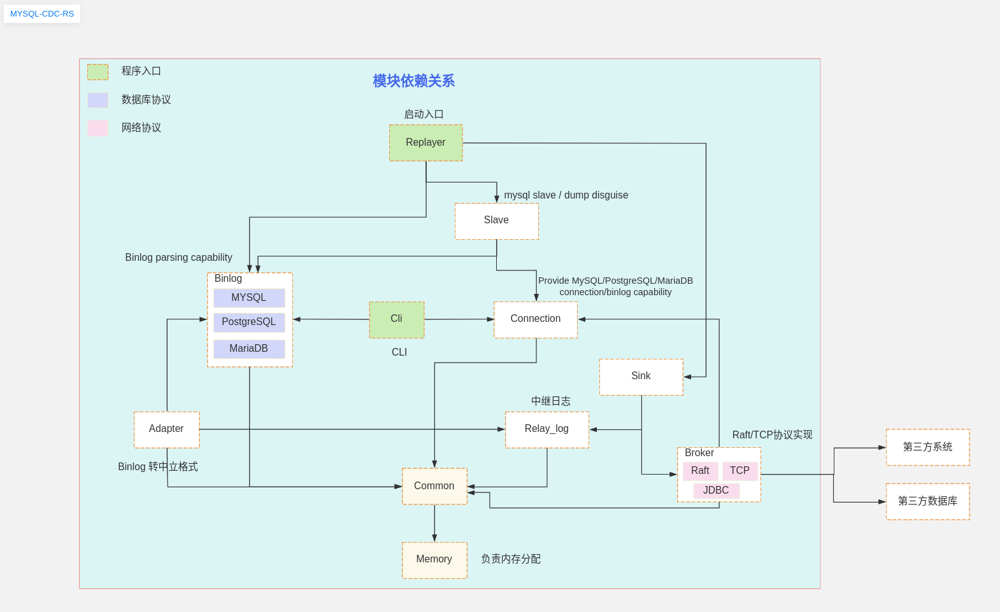

# ForMe

[中文版](./README_ZH.md)

MySQL binlog replication client for Rust. 
Is a clean, idomatic Rust implementation of a MySQL binlog parser, 
including support for the JSONB type introduced in MySQL 5.6/5.7/8.0.

Its primary purpose is handling row-based logging messages, 
but it has rudimentary support for older statement-based replication.
It's been tested against  (MySQL) 5.6 and 5.7 and 8.0.

This library seeks to be competitive with mysqlbinlog at time-to-parse a full binlog file. 
All interesting datatypes are serializable using Serde, 
so it's easy to hook into other data processing flows.


# Limitations

Please note the lib currently has the following limitations:
* Supports only standard auth plugins mysql_native_password and caching_sha2_password.
* Currently, the library doesn't support SSL encryption.
* Doesn't handle split packets (16MB and more).


# Development environment
In order to reduce the probability of execution errors and improve the functional features,
we unify the versions of the Rust toolchain and switch the following commands:

```text
 rustup default nightly
```

You can check it out in the ` rustup toolchain list `. If not, it will be automatically downloaded.


# Architecture
## mysql-cdc-rs-architecture


## Module Design
```

+-- binlog： Implementation of the ability to parse binlog events
+-- binlog-Adapter： Implementation of converting binlog event data structure to neutral data output
    -- log: Default binlog data log output
    -- relay_log: Default relay log output for binlog data
+-- binlog_cli： CLI Client
+-- common: Basic Type Definition
+-- conf: Project default configuration file
+-- connection: Provide MySQL/PostgreSQL/MariaDB connectivity and binlog subscription capabilities
+-- doc: Documents
+-- memory: allocator
+-- raft: raft Protocol(Broker Impl)
+-- relay_log: relay logs
+-- replayer: Main
+-- rpc: rpc Protocol
+-- sink: Relay data push to broker service
+-- slave: Provide MySQL slave disguise and dump capabilities
+-- tests: test case

```


# How to Use


# CLI
See [BinlogCLI README.md](binlog_cli/README.md)

## DEMO VIEW
http://s.codealy.com/rust_us/mysql_cdc_rs/2024.02%20binlog%20cli%20view.webm


# Support Event
See [Binlog README.md](binlog/README.md)

It is a MySQL binlog file parsing library based on Rust implementation,

Pure Rust implementation, no need for MySQL server library, but can also subscribe to MySQL master server.

The goal of the project is to parse every field of the binlog event as much as possible.

Parsed events matrix:

| Hex  | Event Name                | Support             | Tested           | Noted |
|------|---------------------------|---------------------|------------------|-------|
| 0x00 | UNKNOWN_EVENT             | support and         | not tested       |       |
| 0x01 | START_EVENT_V3            | too old and support | not tested       |       |
| 0x02 | QUERY_EVENT               | support             | tested           |       |
| 0x03 | STOP_EVENT                | support             | not tested       |       |
| 0x04 | ROTATE_EVENT              | support             | tested           |       |
| 0x05 | INTVAR_EVENT              | support             | tested           |       |
| 0x06 | LOAD_EVENT                | not fully support   | not tested       |       |
| 0x07 | SLAVE_EVENT               | not fully support   | not tested       |       |
| 0x08 | CREATE_FILE_EVENT         | not fully support   | not tested       |       |
| 0x09 | APPEND_BLOCK_EVENT        | not fully support   | not tested       |       |
| 0x0a | EXEC_LOAD_EVENT           | not fully support   | not tested       |       |
| 0x0b | DELETE_FILE_EVENT         | not fully support   | not tested       |       |
| 0x0c | NEW_LOAD_EVENT            | support             | not tested       |       |
| 0x0d | RAND_EVENT                | support             | not tested       |       |
| 0x0e | USER_VAR_EVENT            | support             | not fully tested |       |
| 0x0f | FORMAT_DESCRIPTION_EVENT  | support             | tested           |       |
| 0x10 | XID_EVENT                 | not fully support   | tested           |       |
| 0x11 | BEGIN_LOAD_QUERY_EVENT    | not fully support   | tested           |       |
| 0x12 | EXECUTE_LOAD_QUERY_EVENT  | not fully support   | not tested       |       |
| 0x13 | TABLE_MAP_EVENT           | support             | tested           |       |
| 0x14 | PreGaWriteRowsEvent(v0)   | not support         | not tested       |       |
| 0x15 | PreGaUpdateRowsEvent(v0)  | not support         | not tested       |       |
| 0x16 | PreGaDeleteRowsEvent(v0)  | not support         | not tested       |       |
| 0x17 | WRITE_ROWS_EVENTv1        | support             | tested           |       |
| 0x18 | UPDATE_ROWS_EVENTv1       | support             | tested           |       |
| 0x19 | DELETE_ROWS_EVENTv1       | support             | tested           |       |
| 0x1a | INCIDENT_EVENT            | not fully support   | not tested       |       |
| 0x1b | HEARTBEAT_EVENT           | not fully support   | not tested       |       |
| 0x1c | IGNORABLE_EVENT           | support             | not tested       |       |
| 0x1d | ROWS_QUERY_EVENT          | not fully support   | not fully tested |       |
| 0x1e | WRITE_ROWS_EVENTv2        | support             | not fully tested |       |
| 0x1f | UPDATE_ROWS_EVENTv2       | support             | not fully tested |       |
| 0x20 | DELETE_ROWS_EVENTv2       | support             | not fully tested |       |
| 0x21 | GTID_EVENT                | support             | tested           |       |
| 0x22 | ANONYMOUS_GTID_EVENT      | support             | tested           |       |
| 0x23 | PREVIOUS_GTIDS_EVENT      | support             | tested           |       |
| 0x24 | TRANSACTION_CONTEXT_EVENT | not support         | not tested       |       |
| 0x25 | VIEW_CHANGE_EVENT         | not support         | not tested       |       |
| 0x26 | XA_PREPARE_LOG_EVENT      | not support         | not tested       |       |
| 0x27 | PARTIAL_UPDATE_ROWS_EVENT | not support         | not tested       |       |
| 0x28 | TRANSACTION_PAYLOAD_EVENT | not support         | not tested       |       |
| 0x29 | HEARTBEAT_LOG_EVENT_V2    | not support         | not tested       |       |
